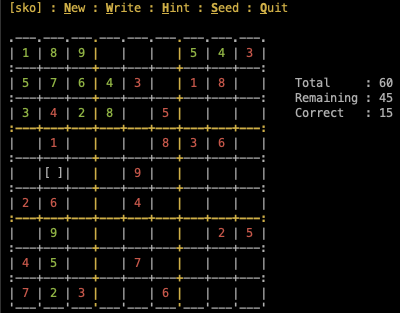

# SKO

A quick-n-dirty game of Sudoku for the terminal.

## Usage

Compile & run the `sko` binary. The keyboard keys are mapped as the following...

 - <kbd>N</kbd> Start a new game.
 - Set a difficulty level
    - <kbd>S</kbd> Super easy
    - <kbd>E</kbd> Easy
    - <kbd>M</kbd> Medium
    - <kbd>A</kbd> Advanced
    - <kbd>H</kbd> Hard
 - <kbd>H</kbd> Hint
 - <kbd>Q</kbd> Quit

## Compile from source

Basic autotools are used.

    autoreconf -i -f
    ./configure
    make
    sudo make install

## Feedback

This project was just for fun.
Any [issues & feedback](https://github.com/emcconville/sko/issues) are welcomed.
